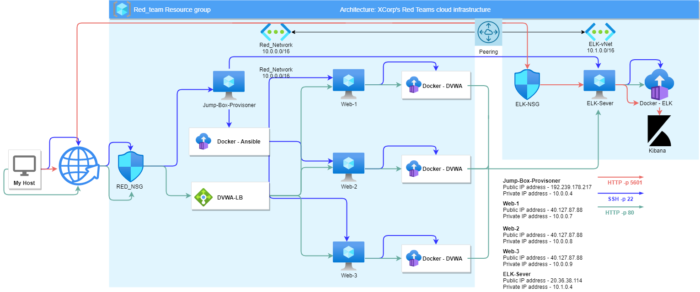
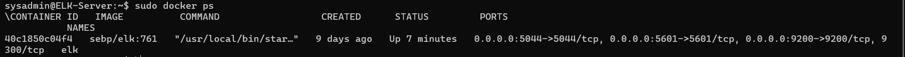

# Cyber-Project
Ansible YAML, Bash scripts and Network diagrams

## Automated ELK Stack Deployment

The files in this repository were used to configure the network depicted below.

These files have been tested and used to generate a live ELK deployment on Azure. They can be used to either recreate the entire deployment pictured above. Alternatively, select portions of the YAML file may be used to install only certain pieces of it, such as Filebeat.

- [Ansible Filebeat Playbook](https://github.com/tomdixonn/Cyber-Project/blob/main/Ansible/filebeat-playbook.yml)

This document contains the 
following details:
- Description of the Topology
- Access Policies
- ELK Configuration
  - Beats in Use
  - Machines Being Monitored
- How to Use the Ansible Build

### Description of the Topology

The main purpose of this network is to expose a load-balanced and monitored instance of DVWA, the D*mn Vulnerable Web Application.

Load balancing ensures that the application will be highly available, in addition to restricting access and unwated traffic to the network.

- What aspect of security do load balancers protect?
  Availability and various forms web traffic, one example being from DDoS attacks.

- What is the advantage of a jump box?
  To allow your cloud architecture to only be automated, secured and administered from a single machine with restricted access from the internet.

Integrating an ELK server allows users to easily monitor the vulnerable VMs for changes to the data and system logs and activity.
- What does Filebeat watch for?
  It watches user specified files and locations for log collections. It can then pass on the logs to log stash to be used in the ELK stack.

- What does Metricbeat record?
  Metricbeat takes the metrics and statistics that it records and then can be outputted for use in the ELK stack.

The configuration details of each machine may be found below.

| Name                 | Function | IP Address | Operating System |
| -------------------- | -------- | ---------- | ---------------- |
| Jump-Box-Provisioner | Gateway  | 10.0.0.4   | Linux            |
| Web-1                | Server   | 10.0.0.7   | Linux            |
| Web-2                | Server   | 10.0.0.8   | Linux            |
| Web-3                | Server   | 10.0.0.9   | Linux            |
| ELK-Server           | Server   | 10.1.0.4   | Linux            |

### Access Policies

The machines on the internal network are not exposed to the public Internet. 

Only the Jump-Box-Provisioner, the DVWA web app and the Kibana web interface can accept connections from the Internet. Access to these machines and applications are only allowed from the following IP addresses:
- My Public IP 

Machines within the network can only be accessed from IP addresses specified in Security rules set in RED-NSG and ELK-NSG
- Which machine did you allow to access your ELK VM? What was its IP address?
- Jump-Box-Provisioner IP: 10.0.0.4 

A summary of the access policies in place can be found in the table below.

| Name                 | Publicly Accessible | Allowed IP Addresses   |
| -------------------- | ------------------- | ---------------------- |
| Jump-Box-Provisioner | No                  | My Public IP           |
| Web-1                | No                  | 10.0.0.4, My Public IP |
| Web-2                | No                  | 10.0.0.4, My Public IP |
| Web-3                | No                  | 10.0.0.4, My Public IP |
| ELK-Server           | No                  | 10.0.0.4, My Public IP |

### Elk Configuration

Ansible was used to automate configuration of the ELK machine. No configuration was performed manually, which is advantageous because ansible playbooks can be written using the YAML syntax to have all applications, 
services and settings quickly up and running for the systems desired purpose. This can be configured to run across many machines simultaneously while always outputting the same result.  

The playbook implements the following tasks: Here is and example of 3 parts of the anisble playbook.

- ...     - name: docker.io
      apt:
        update_cache: yes
        name: docker.io
        state: present
- ...    - name: Install Docker python module
      pip:
        name: docker
        state: present
- ...    - name: download and launch a docker elk container
      docker_container:
        name: elk
        image: sebp/elk:761
        state: started
        restart_policy: always

The following screenshot displays the result of running `docker ps` after successfully configuring the ELK instance.

### Target Machines & Beats
This ELK server is configured to monitor the following machines:
- Web-1 : 10.0.0.7
- Web-2 : 10.0.0.8
- Web-3 : 10.0.0.9

We have installed the following Beats on these machines:
 - ELK-Sever, Web-1, Web-2 and Web-3

These Beats allow us to collect the following information from each machine:
- FileBeat collects data on files and locations. MetricBeat monitors metrics from the server giving the user statistics about system health and proformance.

### Using the Playbook
In order to use the playbook, you will need to have an Ansible control node already configured. Assuming you have such a control node provisioned: 

SSH into the control node and follow the steps below:
- Copy the [Ansible ELK Playbook](https://github.com/tomdixonn/Cyber-Project/blob/main/Ansible/config_elk_vm.yml) file to command line.
- Update the /etc/ansible/hosts file to include [elk] 10.1.0.4 ansible_python_interpreter=/usr/bin/python3 
- Run the playbook, and navigate to http://20.36.38.114:5601/app/kibana to check that the installation worked as expected.

